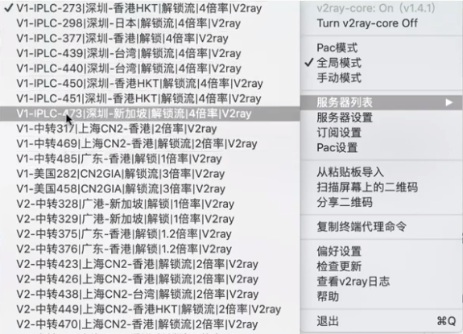
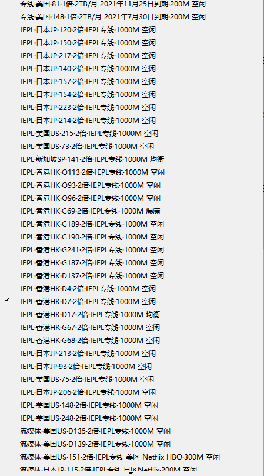
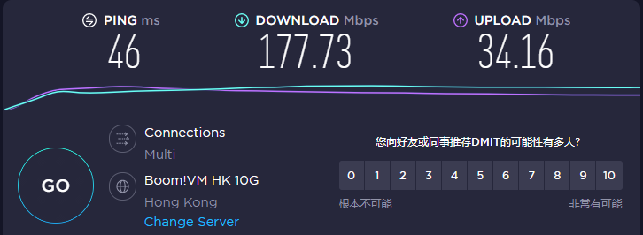
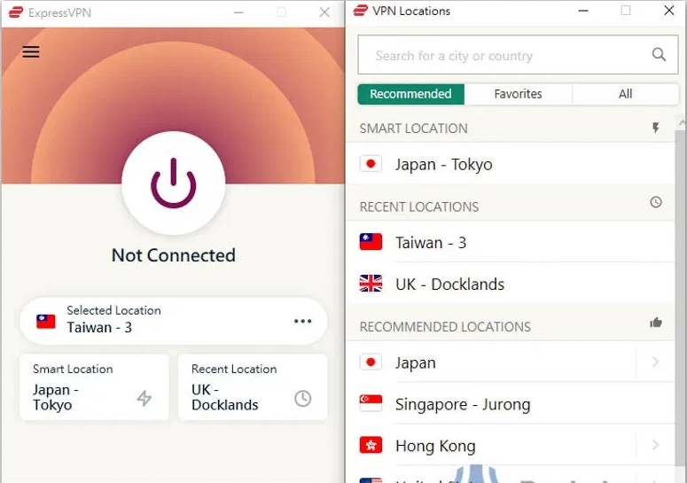

# 两款稳定好用的梯子软件推荐，Trojan+V2ray节点，速度真的香

### 最近又有时间了，给大家写篇文章安利两款比较稳定好用的爬墙梯子软件，两款梯子都是V2ray+Trojan双协议的，所以并不会存在频繁断线断网或者封号一系列问题，网络稳定延迟低，而且都是自己用过的大量梯子当中挑选出来比较好用的两款。

## 第一款是西部世界（Westworld 梯子），网址是：[点击访问网站](https://xbsj4621.fun/i/art080)

这款梯子是我用的最久的一款，为什么记得这么清楚？因为当初汤不热还是每个lsp手机里必装的软件的时候，这款梯子就已经在汤不热上小有名气了，因为用它刷汤不热的视频速度是真的快，而且使用界面简洁，操作也方便简单，所以我一直就用到现在。

起初这款梯子使用的是ss和ssr节点，比较早接触梯子的朋友应该知道，那时候小火箭配合ssr节点真的好用到飞起，也是主流的搭配用法，只不过后来渐渐被封的越来越严重，这个梯子也逐渐转型Trojan+V2ray节点。

尤其一点值得说的是，这款梯子是圈子里第一家使用Trojan协议的，可见他们的团队在售后和更新维护这一块比较看重。

目前西部世界梯子采用的是全站IEPL专线，所有节点，无一例外，这个在很大程度上提高了用户的使用体验，毕竟不需要在晚高峰和大家在狭窄的公网上抢网速，这个还是很爽的。

**Mac客户端截图：**

**Windows客户端截图：**

而且因为梯子已经运营了好多年了，也不用担心跑路等问题。

后台的客户端有ios/安卓/windows/mac/Linux，覆盖了所有主流系统，所以不管是使用什么设备，只需要去他们官网下载客户端，一键安装后登录，开启使用，就能够畅快地浏览无界网络，对于新用户来说，简单快捷的操作也降低了使用门槛。

更重要的是，他们的价格很良心，真的不贵，我看过好多线路质量差的离谱，看视频断断续续，五分钟视频能卡七八次的梯子都敢卖三十左右一个月，西部世界的线路质量比他们更好，看视频一点都不会卡顿，但是价格卖的却比他们更低，任何人都能够接受他们的价格。

其实一款梯子是不是好用稳定，最重要的还是看用户反馈和它运营的年限，西部世界从汤不热大火的时候出道，我用到今天也有三四个年头了，售后维护和更新这块也一直很稳定，这也是我一直在他们家持续续费的原因。

放几张我用西部世界梯子进行测速的截图，我自己用的是电信100M宽带，大家可以作为参考：

**Youtube测速：**

## 第二款就是大名鼎鼎的Express VPN，网址是：[点击访问网站](www.express.com)

这款梯子当初折磨了我好久，因为用起来是真的挺好用，但是价格也是真的贵，堪称替梯子中的爱马仕，大家如果对此比较好奇，可以自己登录他们的官网去看下价格，就会知道我说的一点都没错。

犹犹豫豫了很久，终于有一次网友私信我测评，才狠下决定买了付费。

测试下来的体验就是它的性能对得起它的这个价格。

Express的官网是全英文界面，不过这个应该不是门槛，因为网上在线翻译功能很方便，所以即使不会英文也能很容易上手他们的服务。

对于用户隐私这块，Express很关注，声明不会泄露任何用户数据，不过话说回来，每一家梯子都是声明不会泄露用户数据的，所以如果大家只是上网看看视频，刷刷图片，这点倒是不需要去担心

这款梯子我感觉最好用的点在于，他们提供的线路选择很多，毕竟有3000多台服务器作为后勤保障，节点地区遍布世界上的94个国家，虽然不属于独领风骚，但也是站在山顶的那一拨人之一了。

抛开专业的不谈，就看视频和上网而言，这款梯子带来的速度体验和西部世界差不多，所以针对大部分网友，我感觉选择西部世界更合适，但如果对于某部分精英人群或者有特殊要求的人，那么Express也可以作为考虑的选项。

Windows客户端截图：

两款[好用稳定的梯子](https://github.com/gelangtai/fourVpn/)，大家可以根据自己的实际情况去选择。
